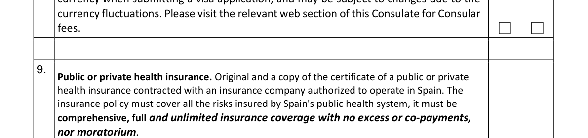

## Short answer

Spain's Digital Nomad Visa (BLS London route) requires comprehensive health insurance from an insurer authorized to operate in Spain, with unlimited coverage and no deductibles, co-payments, or waiting period. The checklist also requires coverage of risks insured by Spain's public health system (Source: `BLS_ES_DNV_LONDON_2026`, page 2, item 9; verified 2026-01-12).

## Key findings at a glance

| Item | Value |
|---|---|
| Route | Spain DNV (Consulate via BLS London) |
| Evidence verified | 2026-01-12 |
| Snapshot | releases/2026-01-16 |
| GREEN / RED / UNKNOWN | 1 / 5 / 1 |

## What the authority requires

*Source: ES_DNV_BLS_LONDON_checklist_2026-01-12.pdf (page 2, item 9)*

- Insurance is mandatory for all applicants. (Source: `BLS_ES_DNV_LONDON_2026`, locator: page 2, item 9; verified 2026-01-12)
- The insurer must be authorized to operate in Spain. (Source: `BLS_ES_DNV_LONDON_2026`, locator: page 2, item 9; verified 2026-01-12)
- The policy must cover risks insured by Spain's public health system. (Source: `BLS_ES_DNV_LONDON_2026`, locator: page 2, item 9; verified 2026-01-12)
- Coverage must be comprehensive, full, and unlimited. (Source: `BLS_ES_DNV_LONDON_2026`, locator: page 2, item 9; verified 2026-01-12)
- No deductible (excess) is allowed. (Source: `BLS_ES_DNV_LONDON_2026`, locator: page 2, item 9; verified 2026-01-12)
- No co-payments are allowed. (Source: `BLS_ES_DNV_LONDON_2026`, locator: page 2, item 9; verified 2026-01-12)
- No moratorium (waiting period) is allowed. (Source: `BLS_ES_DNV_LONDON_2026`, locator: page 2, item 9; verified 2026-01-12)

Normalized requirements table:

| Requirement | Source URL | Locator | Verified date |
|---|---|---|---|
| Insurance is mandatory | https://uk.blsspainvisa.com/london/assets/images/pdf/checklists/checklist-DIGITAL-NOMAD-VISA-TEL.pdf | page 2, item 9 | 2026-01-12 |
| Insurer authorized in Spain | https://uk.blsspainvisa.com/london/assets/images/pdf/checklists/checklist-DIGITAL-NOMAD-VISA-TEL.pdf | page 2, item 9 | 2026-01-12 |
| Covers public health system risks | https://uk.blsspainvisa.com/london/assets/images/pdf/checklists/checklist-DIGITAL-NOMAD-VISA-TEL.pdf | page 2, item 9 | 2026-01-12 |
| Comprehensive, full, unlimited coverage | https://uk.blsspainvisa.com/london/assets/images/pdf/checklists/checklist-DIGITAL-NOMAD-VISA-TEL.pdf | page 2, item 9 | 2026-01-12 |
| No deductible / no co-payments / no moratorium | https://uk.blsspainvisa.com/london/assets/images/pdf/checklists/checklist-DIGITAL-NOMAD-VISA-TEL.pdf | page 2, item 9 | 2026-01-12 |

## Verified requirements (PASS/FAIL/UNKNOWN)

| Requirement | Status | Evidence |
|---|---|---|
| Insurance is mandatory | PASS | BLS checklist, page 2, item 9 |
| Insurer authorized in Spain | PASS | BLS checklist, page 2, item 9 |
| Covers public health system risks | PASS | BLS checklist, page 2, item 9 |
| Comprehensive, full, unlimited coverage | PASS | BLS checklist, page 2, item 9 |
| No deductible | PASS | BLS checklist, page 2, item 9 |
| No co-payment | PASS | BLS checklist, page 2, item 9 |
| No moratorium | PASS | BLS checklist, page 2, item 9 |

## How we evaluate

We compare the authority requirements above against product evidence in the rule engine. If any requirement is missing explicit proof, the checker marks it UNKNOWN rather than guessing. See /methodology/ for the full evaluation logic and the UNKNOWN > Wrong principle.

## Proof package checklist

- Original and copy of the insurance certificate from an insurer authorized to operate in Spain (BLS checklist, page 2, item 9).
- Policy or certificate text that explicitly states unlimited, comprehensive coverage with no deductibles, no co-payments, and no moratorium (the checklist requires these features).

## Common rejection traps

- Using an insurer that is not authorized to operate in Spain (directly conflicts with the checklist).
- Submitting a policy with a coverage cap when the checklist requires unlimited coverage.
- Policies that include a deductible or co-payments (the checklist requires none).
- Policies with any waiting period (moratorium) before benefits start.
- A certificate that does not explicitly state the required coverage features (inference: the checklist is specific, so proof should be explicit).

## FAQ

**Q: Is insurance mandatory for Spain DNV (BLS London route)?**
**A:** Yes. The BLS checklist lists health insurance as a required document (Source: `BLS_ES_DNV_LONDON_2026`, page 2, item 9; verified 2026-01-12).

**Q: Does the insurer need to be authorized in Spain?**
**A:** Yes. The checklist requires the insurance be contracted with an insurer authorized to operate in Spain (Source: `BLS_ES_DNV_LONDON_2026`, page 2, item 9; verified 2026-01-12).

**Q: Are deductibles, co-payments, or moratoriums allowed?**
**A:** No. The checklist says no excess or co-payments, nor moratorium (Source: `BLS_ES_DNV_LONDON_2026`, page 2, item 9; verified 2026-01-12).

**Q: Is unlimited coverage required?**
**A:** Yes. The checklist requires comprehensive, full, unlimited coverage (Source: `BLS_ES_DNV_LONDON_2026`, page 2, item 9; verified 2026-01-12).

**Q: Must the policy cover public health system risks?**
**A:** Yes. The checklist requires coverage of all risks insured by Spain's public health system (Source: `BLS_ES_DNV_LONDON_2026`, page 2, item 9; verified 2026-01-12).

## Check in the engine

Use [the compliance checker](/ui/) to check the current snapshot for this route, or use the CTA below:



## Related reading

- [Spain DNV requirements (route page)](/visas/spain/digital-nomad-visa/consulate-via-bls-london/)
- [Spain DNV insurance mistakes](/traps/spain-dnv-insurance-mistakes/)
- [Digital nomad insurance in Europe](/posts/digital-nomad-insurance-europe/)
- [How to read compliance results](/guides/how-to-read-results/)

## Disclaimer + Affiliate disclosure

Not legal advice. Compliance results are evidence-based snapshots.

If an affiliate link is present, it appears only after results and does not change the compliance outcome.

Last updated: 2026-02-05

## Evidence log

- Source: BLS_ES_DNV_LONDON_2026
